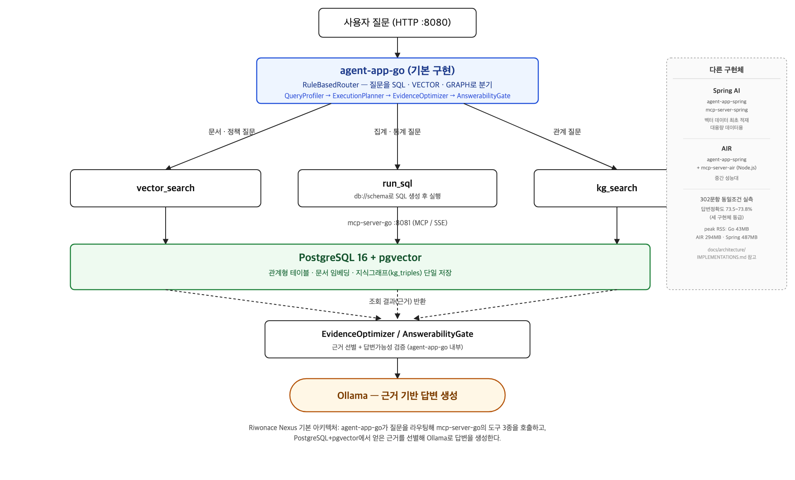

# Riwonace Nexus 최종 결과 보고서

작성일: 2026-08-25 · 기준 커밋: `9bf02eb` (main) · 저장소: https://github.com/qixiangme/riwonace-nexus

## 1. 프로젝트 개요

Riwonace Nexus는 사내 문서, 관계형 테이블, 지식 그래프를 한곳에서 조회하고
일상어 질문에 근거 있는 답을 제공하는 온프레미스 AI 데이터 검색 플랫폼이다.
외부 AI API 대신 로컬 Ollama 모델을 사용하고, 데이터 접근은 MCP(Model
Context Protocol) 도구로 표준화한다.

질문은 성격에 따라 세 갈래로 처리된다.

| 질문 유형 | 처리 경로 |
|---|---|
| 개념·정책·문서 질문 | pgvector 기반 `vector_search` |
| 통계·집계·목록 질문 | 스키마 기반 NL2SQL → 읽기 전용 `run_sql` |
| 사람·제품·프로젝트 관계 질문 | 지식 그래프 `kg_search` |
| 복합 질문 | 필요한 도구를 병렬 호출한 뒤 근거를 선별해 답변 생성 |

에이전트의 핵심 흐름은 다음과 같다.

```
QueryProfiler → ExecutionPlanner → MCP Gateway →
EvidenceOptimizer / ContextCurator → AnswerabilityGate → Ollama
```

단순 질문은 결정적 경로를 유지하고, 복합·실패 가능성이 높은 질문만 실행
계획과 복구 정책을 사용한다. 답변에는 선택한 라우트, 호출한 MCP 도구,
컨텍스트 출처, 지연 시간을 함께 제공해 어떤 데이터로 답했는지 추적할 수
있다.

## 2. 시스템 아키텍처



```
사용자 / React 웹 클라이언트
              │ HTTP :8080
              ▼
        agent-app (Go)
        프로파일링 · 실행계획 · 라우팅 · NL2SQL · 답변 생성
              │ MCP/SSE
              ▼
        mcp-server :8081 (Go)
        검색·SQL·그래프·스키마 도구, 데이터 적재
              │
              ▼
 PostgreSQL 16 + pgvector ── Ollama
 관계형·벡터·그래프 저장       로컬 추론·임베딩
```

MCP 서버가 제공하는 도구:

| 도구 | 역할 |
|---|---|
| `vector_search` | 질문과 의미적으로 가까운 문서 검색 |
| `get_schema` | SQL 생성에 필요한 테이블·열·값 힌트 조회(Resource) |
| `run_sql` | 검증을 통과한 읽기 전용 SELECT/WITH 실행 |
| `kg_search` | 주어–관계–목적어 형태의 지식 그래프 탐색 |

에이전트와 MCP 서버 사이의 경계는 특정 언어·프레임워크가 아니라 이
도구 계약 자체다. 같은 계약을 세 가지 구현체로 만들어 실측 비교했다
(3절).

## 3. 구현체 3-way 비교와 최종 결정

### 3.1 비교 대상

| 구현체 | 구성 | 위치 |
|---|---|---|
| **Go** (기본) | `agent-app-go` + `mcp-server-go` | 표준 실행 경로 |
| Spring AI | `agent-app-spring` + `mcp-server-spring` | 벡터 데이터 최초 적재, 대용량 데이터용 |
| AIR | `agent-app-spring` + `mcp-server-air`(Node.js) | agent-app은 Spring AI 유지, mcp-server만 경량화 |

### 3.2 실측 조건

지정과제 공지가 권장하는 모델은 **Gemma 4 E2B**(Ollama 태그
`gemma4:e2b-it-qat`)다. `eval/generalization-eval.json`(302문항) +
`eval/resource-check-100.json`(100문항 리소스 측정용 서브셋)으로, 동일
모델(`gemma4:e2b-it-qat`, 모델 에스컬레이션 비활성화), 동일 seed(42),
`ROUTER_FALLBACK=semantic-ai` 조건에서 세 구현체를 측정했다.

### 3.3 정확도 (302문항, Gemma 4 E2B)

| 지표 | Go | Spring AI | AIR |
|---|---:|---:|---:|
| 라우팅 정확도 | 100.0% | 100.0% | 100.0% |
| 답변 정확도 | 93.0% | 93.0% | 92.7% |
| SQL 답변 정확도 | 91.1% | 91.1% | 90.5% |
| VECTOR 답변 정확도 | 76.7% | 76.7% | 76.7% |
| GRAPH 답변 정확도 | 100.0% | 100.0% | 100.0% |
| 평균 지연 | 11,447ms | 11,443ms | 11,044ms |

세 구현체는 소수점 단위까지 사실상 동급이다. 초기 검증에 쓴 `gemma3:1b` +
에스컬레이션 조합(답변 정확도 73.5~73.8%) 대비 Gemma 4 E2B 단일 모델은
**19%p 이상 개선**됐다 — SQL 정확도가 55.1%→90.5~91.1%로 크게 뛴 것을
보면, 이전 실패의 상당수가 아키텍처 문제가 아니라 **모델 자체의 이해력
부족**이었음을 알 수 있다. 이 재검증 과정에서 `ModelEscalator`가
`enabled=false`로 꺼도 재에스컬레이션 로직이 이를 무시하던 baseline
버그를 발견해 Spring AI/Go 양쪽에서 수정했다.

### 3.4 리소스 사용량 (100문항, idle 대비 부하 시 peak RSS, `gemma3:1b` 세대 실측)

| 구현체 | agent-app RSS | mcp-server RSS | 합계 |
|---|---:|---:|---:|
| **Go** | 20.5MB | 22.7MB | **43.2MB** |
| AIR | 201.8MB | 87.1MB | 293.9MB |
| Spring AI | 179.6MB | 307.8MB | 487.4MB |

Go는 Spring AI 대비 리소스를 약 11분의 1로 줄인다. 세 구현체 모두 부하를
걸어도(idle → 100문항 처리) peak RSS가 idle 대비 거의 증가하지 않았다 —
이 규모(직원 45명 등 Company-X 시드 데이터 수준)에서는 메모리가 요청량이
아니라 런타임 자체(Go vs JVM vs Node.js)로 결정된다.

### 3.5 latency 조사와 방법론적 발견

최초 측정에서 Go가 baseline보다 3~4배 느리게 나왔다. 이 원인을 추적하는
과정에서 다음을 확인했다.

1. **로컬 macOS의 네이티브 `Ollama.app`과 Docker 컨테이너의 Ollama가
   포트 11434를 동시에 점유**(IPv4/IPv6 각각 바인딩)하고 있어, 요청이
   두 백엔드 중 예측 불가능한 쪽으로 갔다. Java(Spring AI)의 HTTP
   클라이언트는 커넥션을 재사용해 우연히 한산한 백엔드에 고정됐고, Go는
   매 요청 새 커넥션을 맺으며 그때그때 다른(때로는 바쁜) 백엔드로 튕겼다.
2. **macOS Spotlight 인덱싱**(`mds`/`mds_stores`)이 벤치마크와 무관하게
   CPU를 크게 잠식하고 있었다.
3. **`seed` 파라미터 부재**로 Ollama가 `temperature=0`이어도 매 요청 다른
   난수 상태로 샘플링해, 완전히 같은 프롬프트에도 출력 토큰 수가 크게
   요동쳤다(→ PR #118로 seed=42 고정 수정).

세 요인을 모두 제거한 뒤 재측정하니 Go(5,477ms)와 Spring AI(5,319ms)의
latency가 3% 차이로 수렴했다. **latency 차이는 언어 성능 문제가 아니라
로컬 개발 환경의 리소스 경합 문제였다.** 이 결론은 로컬 환경 기준이며,
서버급 GPU 추론 인프라에서는 재검증이 필요하다.

### 3.6 최종 결정: Go를 기본 구현으로 채택

정확도는 동급, 리소스는 11분의 1이라는 실측 근거로 **Go(`agent-app-go`,
`mcp-server-go`)를 기본 실행 경로로 채택**했다. Spring AI는 벡터 데이터
최초 적재와 대용량 데이터 처리용으로, AIR는 agent-app을 Spring AI로
유지하면서 mcp-server만 경량화하고 싶을 때의 중간 성능대 구성으로
위치를 재정의했다.

이 결정은 **소규모 데이터셋**(직원 45명, 수십~수백 row 규모) 실측
기준이다. 다음 조건에서는 Spring AI 전환을 검토해야 한다.

- 핵심 엔티티 규모가 수천~수만 건 이상으로 커지는 경우
- 쿼리 하나가 반환하는 row가 수천 건 이상인 경우
- 동시 접속자·동시 요청이 많아 커넥션 풀 관리가 중요해지는 경우

대용량 데이터에서 Spring AI(HikariCP 커넥션 풀, JDBC 스트리밍, GC 튜닝)가
유리하다는 것은 일반적으로 알려진 특성이며, 이 저장소에서 대용량 데이터로
직접 재현 측정한 결과는 아직 없다. 규모가 커지는 배포를 계획한다면 이
문서의 실측 방법론(`eval/resource-check-100.json` + `ps` 샘플링)을
대용량 시드 데이터로 반복해 전환 임계값을 확인해야 한다.

세부 실측 데이터와 실행 방법은
[`docs/architecture/IMPLEMENTATIONS.md`](../docs/architecture/IMPLEMENTATIONS.md)에
정리했다.

## 4. 정확도 개선 이력

라우팅·NL2SQL·답변 생성 로직은 여러 차례 반복 검증을 거쳤다.

| 단계 | 답변 정확도 | 비고 |
|---|---:|---|
| vanilla MCP(도구 선택을 LLM에 위임) | 30.0% | 과도한 도구 호출, 결과 병합 실패 |
| 결정적 라우팅 + 근거 선별 도입 | 93.3%(복합 30문항) | `RuleBasedRouter`, `EvidenceOptimizer` 도입 |
| baseline 버그 8건 수정 (PR #108) | 40%→90%대 | `AnswerabilityGate` 클레임 오판, `DeterministicSqlPlanner` v2 미연결, 라우팅 키워드 누락, `kg_search` predicate 체이닝 부재 등 |
| 302문항(문체 3~4배 변형) 재검증 | 91.4%→99.0% | 표현 다양성에서 드러난 추가 버그 3건 수정 |
| 완전히 다른 데이터셋(Nova-Tech) 홀드아웃 298문항 | 96.0%→99.7% | Company-X 고유값 암기 여부 배제, 하드코딩 2건 발견·수정 |
| Go/AIR에 baseline 수정 반영 (PR #113, #117) | 73.8%/73.5% | 3-way 동일 조건 재검증(3절), `gemma3:1b` + 에스컬레이션 기준 |
| 지정과제 권장 모델 Gemma 4 E2B로 전환 | 92.7~93.0% | 모델 에스컬레이션 없이 단일 모델로 재검증(3.3절), `ModelEscalator` enabled 플래그 무시 버그 발견·수정 |

핵심 교훈: **적은 문항 수(30개)의 개선이 큰 문항 수(93개, 302개)로
일반화된다고 가정하지 않고, 표현을 바꾸거나 완전히 다른 데이터로
재검증할 때마다 정확도가 실제로 하락하는지 확인했다.** 이 과정에서
Company-X 데이터셋 고유값에 암기된 하드코딩을 여러 차례 발견해 제거했다.

## 5. 소프트웨어 구성 목록 (SBOM)

| 구분 | 구성 요소 | 버전 | 용도 |
|---|---|---|---|
| 언어/런타임 | Go | 1.21+ | 기본 구현(agent-app-go, mcp-server-go) |
| 언어/런타임 | Kotlin | 2.1 | Spring AI 구현(적재·대용량용) |
| 언어/런타임 | Java | 17+ | Spring AI 실행 환경 |
| 언어/런타임 | Node.js | — | AIR 구현(mcp-server-air) |
| 프레임워크 | Spring Boot | 3.5 | Spring AI 구현 웹 프레임워크 |
| 프레임워크 | Spring AI | 1.0 | Ollama/MCP/pgvector 연동 |
| 프레임워크 | `@airmcp-dev/core` | ^0.3.0 | AIR MCP 서버 프레임워크 |
| MCP SDK | `github.com/modelcontextprotocol/go-sdk` | v1.7.0 | Go 구현체 MCP 클라이언트/서버 |
| DB 드라이버 | `github.com/jackc/pgx/v5` | v5.10.0 | Go의 PostgreSQL 드라이버 |
| DB 드라이버 | `github.com/pgvector/pgvector-go` | v0.4.1 | Go의 pgvector 연동 |
| DB 드라이버 | `pg` (npm) | ^8.13.0 | AIR의 PostgreSQL 드라이버 |
| 데이터베이스 | PostgreSQL | 16 | 관계형/벡터/그래프 통합 저장 |
| 데이터베이스 확장 | pgvector | — | 문서 임베딩 벡터 저장·검색 |
| 로컬 AI 런타임 | Ollama | — | 로컬 LLM 추론 서버 |
| LLM 모델 | `gemma4:e2b-it-qat` | — | 지정과제 권장 모델(Gemma 4 E2B), 기본 답변/NL2SQL 생성 |
| LLM 모델 | `gemma3:1b` | — | 초기 검증에 사용한 이전 세대 모델(현재는 비기본) |
| LLM 모델 | `qwen2.5:3b`/`qwen2.5:7b` | — | 모델 에스컬레이션 옵션(기본 비활성화) |
| 임베딩 모델 | `nomic-embed-text` | — | 문서 임베딩 |
| 웹 클라이언트 | React | 19 | 선택형 대화 UI |
| 웹 클라이언트 | TypeScript | 5.7 | 클라이언트 정적 타입 |
| 웹 클라이언트 | Vite | 6 | 클라이언트 빌드 도구 |
| 빌드/검증 | Gradle Kotlin DSL | — | Spring AI 구현 빌드 |
| 빌드/검증 | npm | — | 클라이언트/AIR 빌드 |
| 빌드/검증 | JUnit 5 | — | Kotlin 테스트 |
| 빌드/검증 | go test | — | Go 테스트 |
| 인프라 | Docker Compose | — | PostgreSQL/Ollama 로컬 실행 |
| CI | GitHub Actions | — | server-tests/client-build/eval-harness |

## 6. 테스트와 CI 체계

- **CI 대상**: `agent-app-spring`/`mcp-server-spring`(Gradle test),
  `client`(npm build), `eval/`(Python 테스트)를 GitHub Actions로 자동
  검증한다.
- **Go 구현체 검증**: `agent-app-go`/`mcp-server-go` 각각의
  `go test ./...`로 자체 검증한다(원본 Kotlin 오라클 테스트를 1:1로
  포팅한 테스트 스위트 포함).
- **AIR 검증**: `mcp-server-air`의 자체 `npm test` +
  `contract-smoke.mjs`(MCP 도구/리소스 계약 스모크 테스트)로 검증한다.
- **벤치마크 무결성**: 벤치마크를 변경하면 같은 데이터셋·모델·설정·반복
  횟수로 기준선과 후보를 모두 측정하고, 문항별 원시 JSON 결과를
  보존한다(`docs/contributing/BENCHMARK_POLICY.md`).

## 7. 개발 프로세스

- 총 44개 PR, 71개 커밋으로 진행했다. 초기 아키텍처 수립 →
  Spring AI 기반 벤치마크 최적화 → AIR/Go 대체 구현 실험 →
  Go 기본 구현 승격의 순서로 발전했다.
- 이슈·PR 템플릿은 기준 브랜치, 현재 문제 증거, 전후 검증 방법, 위험과
  되돌리기, 주·보조 평가항목을 필수 항목으로 요구한다
  (`docs/contributing/WORKFLOW.md`).
- 폴더명은 프레임워크/언어 접미사로 통일했다(`agent-app-spring`,
  `mcp-server-spring`, `agent-app-go`, `mcp-server-go`,
  `mcp-server-air`) — PR #116.
- 프로젝트명을 "Riwonace Nexus"로, 저장소를 `riwonace-nexus`로
  변경했다 — PR #114.

## 8. 알려진 한계와 향후 과제

- **대용량 데이터 미검증**: 이번 실측은 소규모 데이터셋(Company-X 시드,
  직원 45명 수준) 기준이다. 대용량 데이터에서 Go/Spring AI의 리소스·정확도
  격차가 어떻게 변하는지는 아직 실측하지 않았다.
- **AIR 스키마 계약 격차**: `get_schema` 응답의 `foreignKeys` 필드가
  누락되어 있다(이슈 #49). AIR로 실제 운영 트래픽을 받게 할 계획이라면
  이 부분부터 해소해야 한다.
- **AIR 에러 처리**: JSON 문자열을 문자 수 기준으로 truncate해 잘린
  JSON이 파싱 실패로 이어질 수 있고, 원본 DB 예외 메시지를 그대로 반환해
  내부 구조가 노출될 수 있다.
- **Go 표현 다양성 검증 범위**: Go 포팅은 baseline과 같은 302문항+홀드아웃
  검증을 통과했지만, 완전히 다른 데이터셋(별도 시드)으로는 아직 반복
  검증하지 않았다.
- **GPU 추론 미검증**: 이번 latency 실측은 로컬 macOS + Docker
  Desktop(CPU 전용 Ollama 추론) 환경 기준이다. 서버급 GPU 추론
  인프라에서는 재검증이 필요하다.

## 9. 참고 문서

| 문서 | 내용 |
|---|---|
| [README.md](../README.md) | 빠른 시작, 전체 구조, 모듈 안내 |
| [ARCHITECTURE.md](../ARCHITECTURE.md) | 전체 구조, 요청 처리 흐름, 주요 설계 결정 |
| [IMPLEMENTATIONS.md](../docs/architecture/IMPLEMENTATIONS.md) | Go/Spring AI/AIR 구현체별 배경, 실행 방법, 실측 비교 |
| [MCP_CONTRACT.md](../docs/architecture/MCP_CONTRACT.md) | MCP 통신 흐름, 도구별 입출력, 보안 계층 |
| [READER_GUIDE.md](../docs/architecture/READER_GUIDE.md) | 시스템을 처음 읽을 때의 안내 |
| [BENCHMARK.md](../BENCHMARK.md) | 벤치마크 결과 및 재현 방법 |
| [CONTEST_ALIGNMENT.md](../docs/CONTEST_ALIGNMENT.md) | 지정과제 정합성 설명 |
